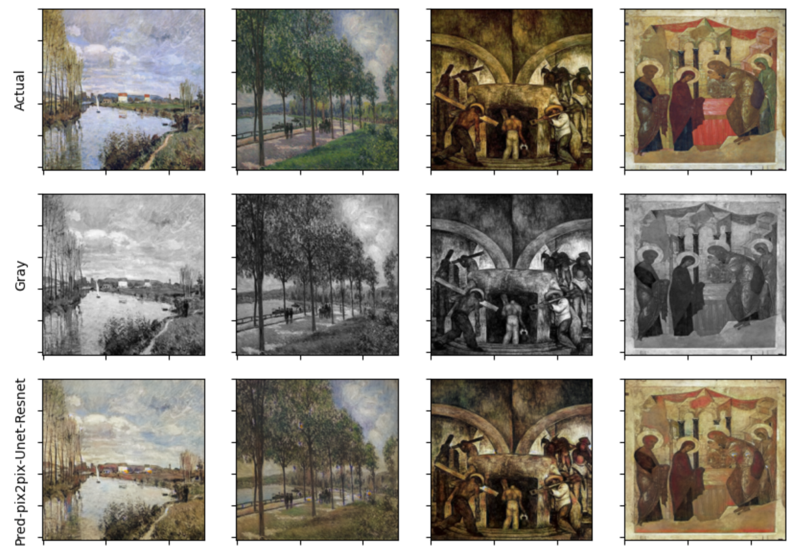

# Bringing vibrance to historical paintings through image colorization

We used Deep Learning techniques to recolor grayscale images of paintings and reconstruct their lost or damaged visual information. We utilize U-Net and Generative Adversarial Networks specifically Conditional Generative Adversarial Networks (cGAN) called pix2pix to colorize grayscale paintings. We use two variations of pix2pix, one with vanilla UNet and the other with UNet having a resnet18 backbone. The ultimate goal of this project is to compare and validate different deep neural networks that can be used to generate plausible and aesthetically pleasing colorizations of grayscale images of paintings to help us rediscover the beauty of the lost artwork. 

